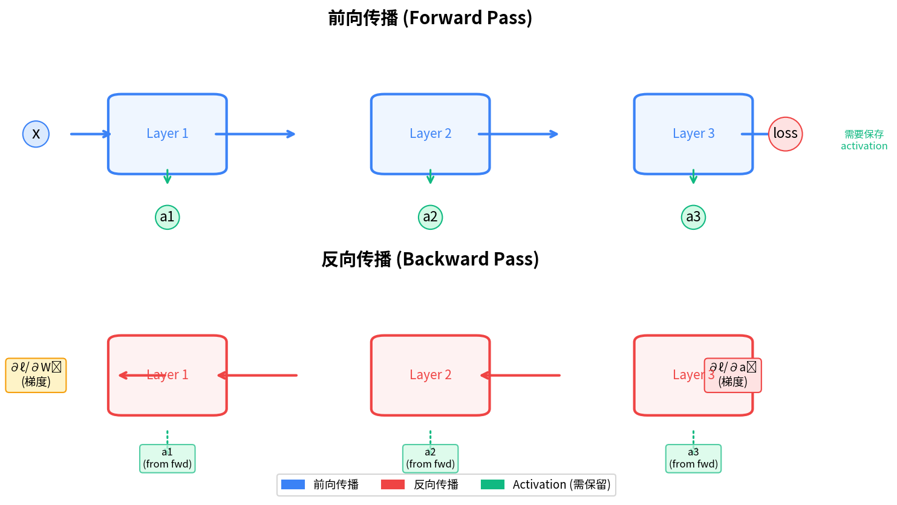
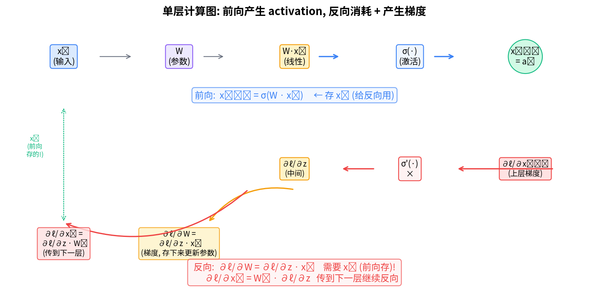
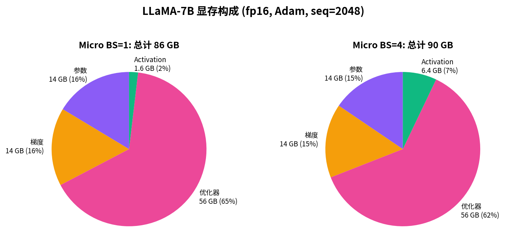
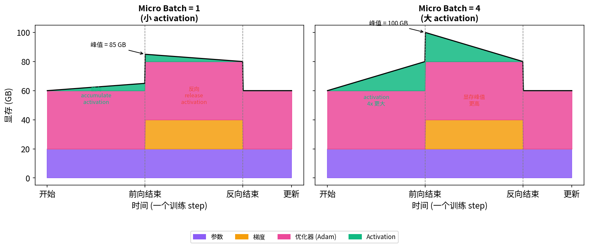
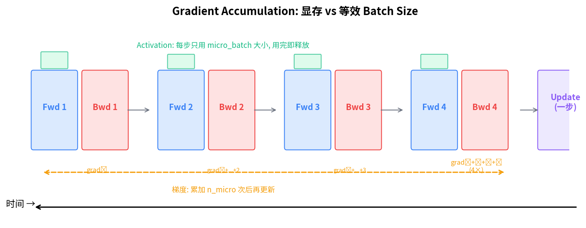

# 深度学习训练基础与显存分析

> 从零回顾：前向传播 → 反向传播 → 显存构成 → Micro Batch 策略

---

## 1. 前向传播 (Forward Pass)

### 1.1 计算图

以一个 L 层网络为例：

```
输入 x  →  Layer₁  →  a₁  →  Layer₂  →  a₂  →  ...  →  Layerₗ  →  loss
```

每一层做的事:

```
前向:  aᵢ = σ(Wᵢ · aᵢ₋₁ + bᵢ)
```

其中:
- `aᵢ₋₁` = 上一层的输出（第 0 层是输入 `x`）
- `Wᵢ, bᵢ` = 本层的权重和偏置
- `σ(·)` = 激活函数（ReLU, GELU 等）
- `aᵢ` = 本层的输出，传给下一层

### 1.2 Activation 的存活

**核心事实**: 前向每层算出的 `aᵢ` 必须保留在显存中，直到反向传播用到它为止。

为什么？因为反向求导需要 `aᵢ` 来计算 `∂loss/∂Wᵢ` (见第 2 节)。



> **图中解读**: 蓝色是前向路径，每一层往下长出绿色的 activation 圆圈。红色是反向路径，反向时每层从绿色圆圈读取前向保存的 activation，用完即释放。

---

## 2. 反向传播 (Backpropagation)

### 2.1 链式法则

损失函数 ℓ 对第 i 层参数 Wᵢ 的梯度，通过链式法则从 loss 往回传播:

```
∂ℓ/∂Wᵢ = (∂ℓ/∂aₗ) · (∂aₗ/∂aₗ₋₁) · ... · (∂aᵢ₊₁/∂aᵢ) · (∂aᵢ/∂Wᵢ)
         \___________________________/            \__________/
          从 loss 传到 aᵢ 的梯度          本层雅可比
          = "上层传下来的梯度"              = 需要 aᵢ₋₁ (前向存)
```

### 2.2 单层细节

放大看第 i 层:



**前向做的**:
```
z = W · xᵢ          (线性变换)
xᵢ₊₁ = σ(z)         (激活函数)
```

**反向做的** (已知上层传来 ∂ℓ/∂xᵢ₊₁):
```
∂ℓ/∂z = σ'(z) ⊙ ∂ℓ/∂xᵢ₊₁    (逐元素乘)
∂ℓ/∂W = ∂ℓ/∂z · xᵢᵀ           ← 需要 xᵢ (前向存!)
∂ℓ/∂xᵢ = Wᵀ · ∂ℓ/∂z           ← 传给下一层 (往前)
```

**关键**: 计算 `∂ℓ/∂W` 必须同时有 `∂ℓ/∂z` (反向当前算) 和 `xᵢ` (前向存的)。

### 2.3 Activation 随时间释放

反向传播是从最后一层往前逐层进行:

| 时间 | 做的事 | Activation 状态 |
|------|--------|----------------|
| t₁ | 算 `∂ℓ/∂aₗ₋₁` 和 `∂ℓ/∂Wₗ` | a₁,...,aₗ₋₂,aₗ₋₁ 还在, aₗ 释放 |
| t₂ | 算 `∂ℓ/∂aₗ₋₂` 和 `∂ℓ/∂Wₗ₋₁` | a₁,...,aₗ₋₂ 还在, aₗ₋₁ 释放 |
| ... | ... | ... |
| tₗ | 算 `∂ℓ/∂W₁` | 所有 activation 释放 |

**反向完成后，activation 显存完全清零。**

---

## 3. 显存构成详解

一个训练 step 中，GPU 显存被以下几部分占用:

### 3.1 参数 (Weights)

- 大小: `Ψ × dtype_bytes`
- 何时分配: 模型创建时，整个训练过程常驻
- 何时释放: 训练结束

### 3.2 梯度 (Gradients)

- 大小: 同参数 `Ψ × dtype_bytes`
- 何时分配: 反向传播开始后逐步产生
- 何时释放: `optimizer.step()` 之后 `optimizer.zero_grad()`

### 3.3 优化器状态 (Optimizer States)

以 Adam 为例，每个参数维护两个动量项:
```
m = β₁·m + (1-β₁)·g      (一阶矩)
v = β₂·v + (1-β₂)·g²     (二阶矩)
```

- 大小: `Ψ × dtype_bytes` (m) + `Ψ × dtype_bytes` (v) = **8Ψ** (fp32, dtype_bytes=4)
- 如果参数是 fp16，优化器状态通常用 fp32 维护，所以 m 和 v 各占 4Ψ，共 **8Ψ**
- 何时分配: 优化器初始化时，到训练结束才释放

### 3.4 Activation (中间激活)

- 大小: 每层 `= micro_bs × seq_len × hidden_dim × dtype_bytes × (2~3)`
- 总大小 ≈ `L × micro_bs × seq_len × hidden_dim × dtype_bytes × 2.5`
- 何时分配: 前向过程中逐层分配
- 何时释放: 反向过程中逐层释放

### 3.5 临时缓冲区 (Temporary Buffers)

- All-Reduce / All-Gather 通信中间结果
- `torch.dot`, `torch.bmm` 等运算的临时张量
- 大小不定，通常是 O(Ψ/N) 级别

### 3.6 显存构成饼图



> 以 LLaMA-7B (Ψ=7e9), fp16, Adam, seq=2048 为例。去掉 activation 后，参数 + 梯度 + 优化器共 **84 GB**，单卡放不下。这就是 ZeRO 要解决的问题。

---

## 4. 一个完整 Step 的时间线

### 4.1 三个阶段

```
阶段 I: 前向传播      阶段 II: 反向传播      阶段 III: 参数更新
0─────────────────── 40 ────────────────── 80 ───────────── 100   (时间 %)
```

**阶段 I — 前向**:
- 逐层计算，逐层产生 activation
- activation 显存从 0 线性增长到峰值
- 参数不变，梯度还没产生

**阶段 II — 反向**:
- 从最后一层往前逐层计算梯度
- 每层产生该层的梯度（梯度数组逐步填满）
- 每层用完 activation 后释放（activation 显存从峰值降到 0）
- **峰值显存出现在阶段 I 结束、阶段 II 开始时**（此时 activation 最大，梯度开始出现）

**阶段 III — 参数更新**:
- 优化器用累加的梯度更新参数
- `optimizer.zero_grad()` 清零梯度
- 所有 activation 已释放

### 4.2 Micro Batch 的影响



> **左图 (micro_bs=1)**: activation 小，显存峰值主要由模型状态决定。
> **右图 (micro_bs=4)**: activation 增大 4 倍，峰值显存大幅提升，可能突破 GPU 上限。

---

## 5. Micro Batch 与 Gradient Accumulation

### 5.1 问题场景

当单卡 batch size 太大 → activation 显存爆炸 → OOM。

### 5.2 解决方案

把一个大 batch 拆成若干 micro batch，逐个 fwd + bwd，累加梯度，最后统一更新参数:

```python
optimizer.zero_grad()
for micro_step in range(grad_acc_steps):
    x, y = load_micro_batch(micro_step)

    # 前向: 只用 micro_batch 的 activation 内存
    loss = model(x)

    # 反向: 算梯度, 累加到总梯度中
    loss.backward()
    # ↑ activation 释放, 腾出空间给下一个 micro batch

# 梯度累加了 grad_acc_steps 次
optimizer.step()          # 一步更新
```

### 5.3 显存 vs 时间的权衡



| 策略 | Activation 显存 | 计算时间 | 等效 batch |
|------|----------------|----------|------------|
| micro_bs=4, grad_acc=1 | 大 (4x) | 1 个单位 | 4 |
| micro_bs=1, grad_acc=4 | 小 (1x) | ~4 个单位 | 4 |
| micro_bs=2, grad_acc=2 | 中 (2x) | ~2 个单位 | 4 |

**本质**: 用时间换显存。每个 micro batch 都要做一次完整的 fwd+bwd，activation 用完即释放。

### 5.4 显存公式汇总

| 组件 | 符号 | 大小 (fp16 + fp32 Adam) |
|------|------|-------------------------|
| 参数 | Ψ | 2Ψ |
| 梯度 | Ψ | 2Ψ |
| 优化器状态 (Adam) | 8Ψ | 8Ψ |
| FP32 主权重 | 4Ψ | 4Ψ |
| **模型状态合计** | **KΨ** | **16Ψ** |
| Activation (每层) | A_layer | `micro_bs × seq_len × hidden × 2 × 2.5` |
| Activation (总计) | A_total | `L × A_layer` |
| **峰值显存** | **peak** | **12Ψ + A_total + 临时缓冲区** |

### 5.5 数值实例: LLaMA-7B

| 参数 | 值 |
|------|-----|
| Ψ (参数量) | 7 × 10⁹ |
| L (层数) | 32 |
| hidden (隐藏维度) | 4096 |
| seq_len (序列长度) | 2048 |
| dtype | fp16 (2 bytes) |

**模型状态** (无 ZeRO):
```
16Ψ = 16 × 7 × 10⁹ × 2 bytes ≈ 224 GB ← 单卡明显不够
```

**Activation** (micro_bs=1):
```
A_total = 32 × 1 × 2048 × 4096 × 2 × 2.5 ≈ 1.34 GB
```

**Activation** (micro_bs=4):
```
A_total = 32 × 4 × 2048 × 4096 × 2 × 2.5 ≈ 5.37 GB
```

**结论**:
- micro_bs 从 1 到 4, activation 增了 4× (约 4 GB)
- 但由于模型状态已经 224 GB，activation 的可变范围只是冰山一角
- **真正的内存大头在模型状态 (16Ψ)**，这就是 ZeRO 切分模型状态的动机

---

## 6. 常见问题

### Q1: 反向传播到底需不需要前向的 activation？

**需要。** 计算 `∂ℓ/∂Wᵢ = ∂ℓ/∂z · xᵢᵀ` 需要 `xᵢ` (=该层的输入，来自前向)，`∂ℓ/∂z` 是反向算出来的。

没有 activation，梯度的计算式缺一个因子，算不了。

### Q2: 为什么不能反向算的时候重新算 activation？

可以——这叫 **重计算 (activation recomputation / checkpointing)**:

```python
# 前向时不存 activation，只存几个 checkpoint
# 反向需要时从最近的 checkpoint 重算
```

代价: 额外 33% 的前向计算量。收益: activation 从 O(L) 降到 O(√L) 甚至 O(1)。

DeepSpeed 和 PyTorch 都支持这个功能。

### Q3: ZeRO-3 中 activation 怎么处理？

ZeRO-3 只切分 **模型状态** (参数/梯度/优化器)。Activation **每卡完整保留**，不被切分。

所以在 ZeRO-3 下:
```
每卡显存 = 16Ψ/N + A_total + 通信缓冲区
```

activation 成为大 batch 场景下的显存瓶颈，可以考虑 activation checkpointing 或 tensor parallelism。

### Q4: Gradient Accumulation 和 Data Parallelism 的关系？

| 技术 | 做什么 | 通信 |
|------|--------|------|
| 数据并行 (DP) | 每卡一份模型，各算各的 batch | 每步一次 All-Reduce |
| 梯度累积 (GA) | 单卡串行算多个 micro batch | 无额外通信 |
| DP + GA | 每卡累积 N 步后再 All-Reduce | 降低通信频率 |

实际训练中两者常同时使用:
```
global_batch_size = num_gpus × micro_batch_size × gradient_accumulation_steps
```

---

## 总结

```
一个训练 step 的完整生命:

  前向: x → Layer₁ → a₁ → Layer₂ → a₂ → ... → Layerₗ → loss
        ↓          ↓           ↓             ↓
   显存: {a₁}    {a₁,a₂}    {a₁,...,aₗ₋₁}  {a₁,...,aₗ}  ← 峰值!

  反向: loss → Layerₗ → ... → Layer₂ → Layer₁
        ↓          ↓           ↓         ↓
   显存: 释放 aₗ   释放 a₂      释放 a₁    0 ← 释放完

  更新: optimizer.step() → 梯度清零
        ↓
   显存: 参数(常驻) + 优化器状态(常驻)
```

**理解清楚这些，你就能回答**:
- 为什么要用 micro batch? → 控制 activation 显存
- 为什么需要 gradient accumulation? → 保持等效 batch 不变
- 反向传播到底在算什么? → 用前向存的 activation 算梯度
- 显存大头在哪? → 模型状态 (16Ψ) → 这就是 ZeRO 优化的目标
